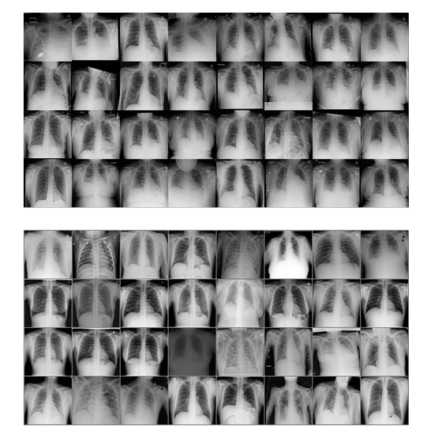

# Diffusion Autoencoder for CXR-Images
This repository is a fork from the [Official implementation of Diffusion Autoencoders](https://github.com/konpatp/diffae), retrained with CXR-Images. 

For the original work please see:
A CVPR 2022 (ORAL) paper ([paper](https://openaccess.thecvf.com/content/CVPR2022/html/Preechakul_Diffusion_Autoencoders_Toward_a_Meaningful_and_Decodable_Representation_CVPR_2022_paper.html), [site](https://diff-ae.github.io/), [5-min video](https://youtu.be/i3rjEsiHoUU)):

```
@inproceedings{preechakul2021diffusion,
      title={Diffusion Autoencoders: Toward a Meaningful and Decodable Representation}, 
      author={Preechakul, Konpat and Chatthee, Nattanat and Wizadwongsa, Suttisak and Suwajanakorn, Supasorn},
      booktitle={IEEE Conference on Computer Vision and Pattern Recognition (CVPR)}, 
      year={2022},
}
```

### Datasets

We use the [COVID-QU-Ex dataset](https://doi.org/10.34740/kaggle/dsv/3122958) to train the diffusion autoencoder.
```
@misc{anas_m__tahir_muhammad_e__h__chowdhury_yazan_qiblawey_amith_khandakar_tawsifur_rahman_serkan_kiranyaz_uzair_khurshid_nabil_ibtehaz_sakib_mahmud_maymouna_ezeddin_2022,
	title={COVID-QU-Ex Dataset},
	url={https://www.kaggle.com/dsv/3122958},
	DOI={10.34740/KAGGLE/DSV/3122958},
	publisher={Kaggle},
	author={Anas M. Tahir and Muhammad E. H. Chowdhury and Yazan Qiblawey and Amith Khandakar and Tawsifur Rahman and Serkan Kiranyaz and Uzair Khurshid and Nabil Ibtehaz and Sakib Mahmud and Maymouna Ezeddin},
	year={2022}
}
``` 
The conversion code is provided as:

```
data_resize_cxr.py
```

The directory tree should be:

```
datasets/
- cxr.lmdb
```
### Prerequisites

See `requirements.txt`

```
pip install -r requirements.txt
```

## Training

To train the diffusion autoencoder please run:
 ```run_cxr128.py``` 
 
Note that two A100s were used for training.


## Example Results

Below is a comparison of a generated sample (bottom) against the original CXR data (top):
<p align="center">

</p>


### Checkpoints

We provide checkpoints at:

1. DiffAE for autoencoding: [CXR Checkpoint](https://drive.google.com/file/d/1BXSC0hN8iStpH40IeZLsYAbxJn39rM8D/view?usp=drive_link)
2. Diffae with latent: [CXR Checkpoint](https://drive.google.com/file/d/10egC1hmfwhNzMA8B19UbYcdsOANoWLMt/view?usp=sharing)
Checkpoints should be put in a separate directory `checkpoints`. 
Download the checkpoint and put it into the `checkpoints` directory. It should look like this:

```
checkpoints/
- last.ckpt
- latent.ckpt 

```

